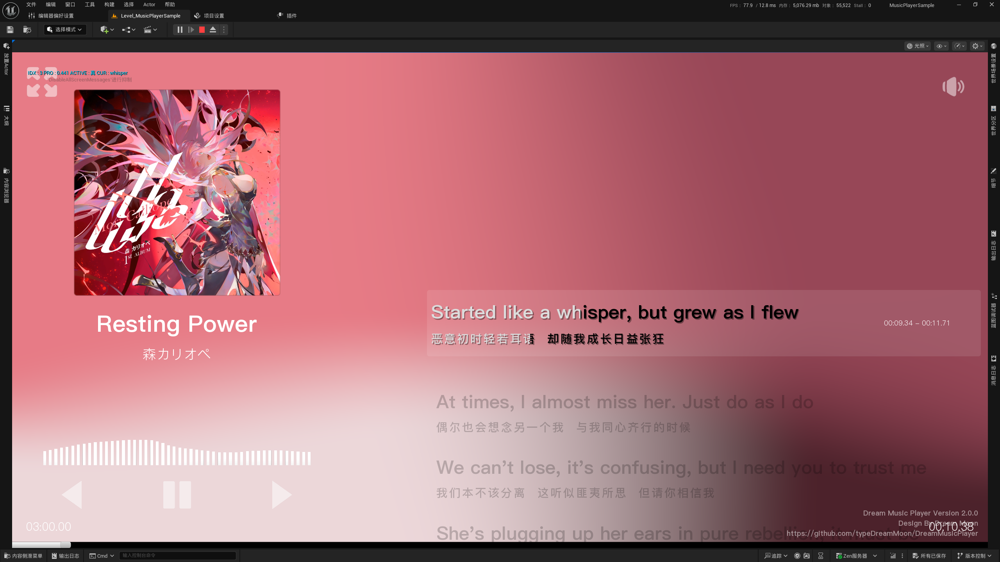
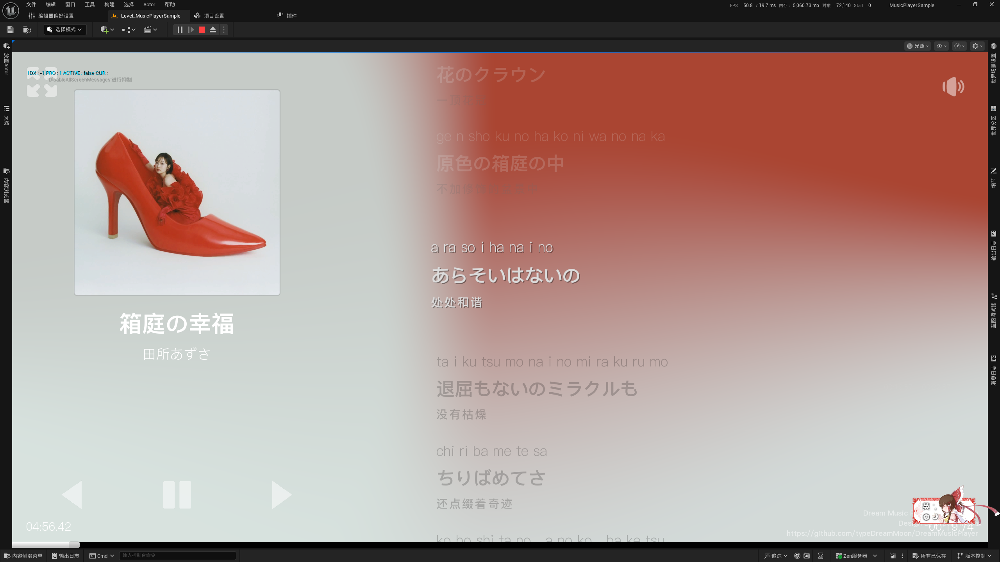
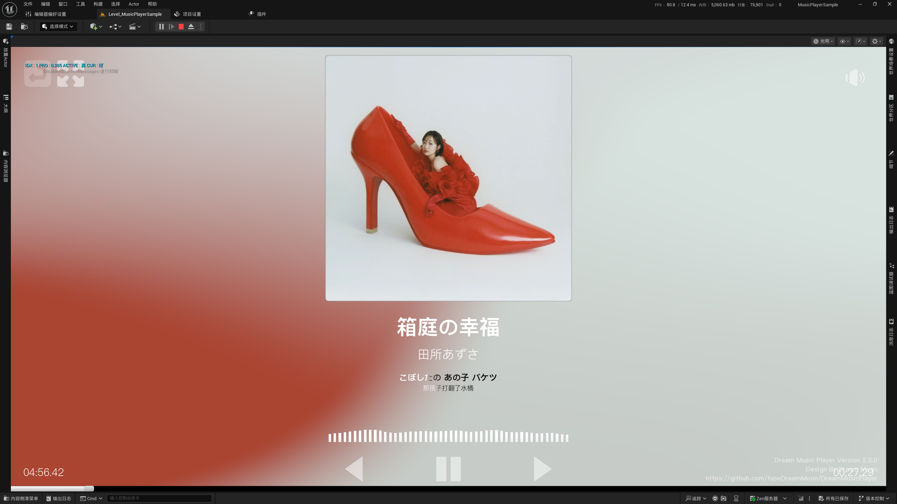
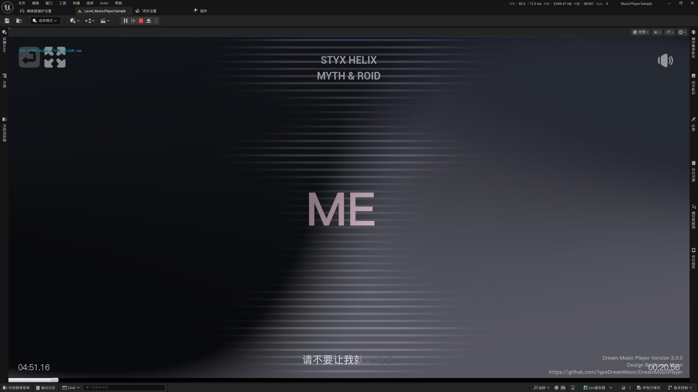
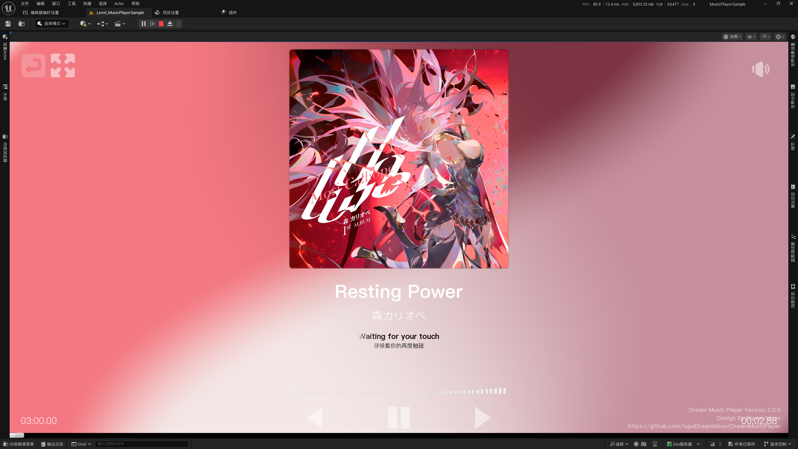
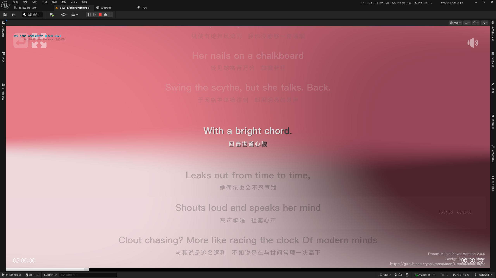

# Dream Music Player Sample Project

---

## Start

1. Unzip Project To Folder

2. Download `Assets.zip` Download at Release

3. Extract the `Assets.zip` file and place the Assets folder in the `Content` directory of the project.

4. Enjoy it.

---

## Version

Unreal Engine Version : `5.6.1`

Dream Music Player Plugin Version: `2.0.0`

---

## Gallery

