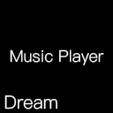

# Dream Music Player

---

### [中文](README_CN.md)

## Developer: [DreamMoon](https://github.com/TypeDreamMoon)

## Sample Project: [Link](https://github.com/TypeDreamMoon/DreamMusicPlayer/tree/5.6-MusicPlayerSample)

## Supported Engine Version: 5.x (requires self-building)

## Developer Engine:

| Plugin Version | Engine Version |
| -------------- | -------------- |
| 1.1.0          | 5.0            |
| 1.1.1          | 5.5            |
| 2.0.0          | 5.6            |

---

## Features:

1. Scrolling lyrics

2. Word-by-word lyrics

3. Runtime parsing of LRC (word-by-word, line-by-line, ESLyric), ASS, SRT lyric files

4. Music fade in/out

5. Music playlists

6. KMeans algorithm-based theme color calculation for music covers

7. Audio visualization

8. Player extensions

9. Click-to-play lyrics

10. ...possible future support for online music playback

---

## Third-party Tools:

1. [Music Tag PC Version - vinlxc - Blog](https://www.cnblogs.com/vinlxc/p/11347744.html)
2. [Releases · chenmozhijin/LDDC · GitHub](https://github.com/chenmozhijin/LDDC/releases)

---

## Support:

-   QQ: 466585194

-   Email: 1067823908@qq.com

-   Bilibili: [梦月\_DreamMoon-Bilibili](https://space.bilibili.com/1115826412)

-   Github: [TypeDreamMoon (DreamMoon) · GitHub](https://github.com/TypeDreamMoon)

-   Discord: [DreamMoonDev](https://discord.gg/MsuXwGpp)

---

## Third-party Assets:

1. https://yesicon.app/

---

## Tutorials

|              Tutorial              |                 YouTube                 |                                                           Bilibili                                                            |
| :--------------------------------: | :-------------------------------------: | :---------------------------------------------------------------------------------------------------------------------------: |
|             P1 Preview             | [YouTube](https://youtu.be/1s6l5LL4gdM) |   [Bilibili](https://www.bilibili.com/video/BV1rk6RYPEvc/?share_source=copy_web&vd_source=a81e6aca9f64409a68ec31aa70046f0c)   |
|             P2 Basics              | [YouTube](https://youtu.be/sttFgOPDo1g) | [Bilibili](https://www.bilibili.com/video/BV1rk6RYPEvc/?p=2&share_source=copy_web&vd_source=a81e6aca9f64409a68ec31aa70046f0c) |
|        P3 Lyric Development        | [YouTube](https://youtu.be/lvammFAA8II) | [Bilibili](https://www.bilibili.com/video/BV1rk6RYPEvc/?p=3&share_source=copy_web&vd_source=a81e6aca9f64409a68ec31aa70046f0c) |
| P4 Audio Visualization Development | [YouTube](https://youtu.be/7b-o5JEmOmE) | [Bilibili](https://www.bilibili.com/video/BV1rk6RYPEvc/?p=4&share_source=copy_web&vd_source=a81e6aca9f64409a68ec31aa70046f0c) |

